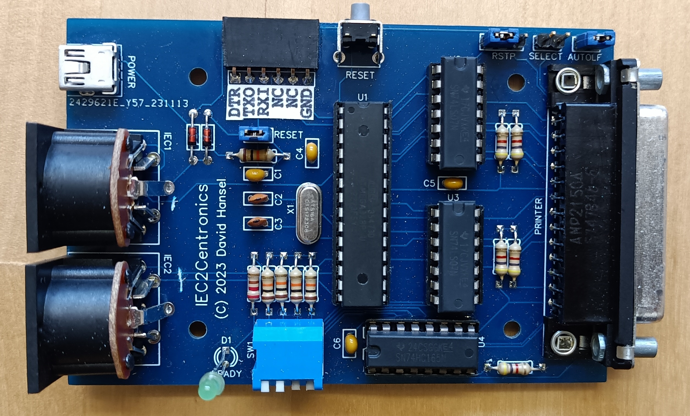

# IECCentronics

This is an adapter that allows attaching Centronics printers to the Commodore IEC bus.
Back in the day [solutions for this did exist](https://www.youtube.com/watch?v=g8cB98p5IS4) but
I wanted to print from my C64 to my Centronics printer, don't have an adapter and couldn't find 
a DIY solution so I came up with this. Actually this is where the IECDevice library started and
I generalized it as I came up with other ideas for devices.

This adapter is made to fill my specific need (attaching a Tandy DMP 130 printer to my C64 and
being able to use existing software with it) but it is designed such that it can be used with
any printer.

As is, the adapter has four main operating modes for relaying data received from the Commodore 
computer to the printer:
1) **No conversion.** In this mode all received data is sent on to the printer without modifications.
This can be helpful if you want to run your own printer software that directly talks to the printer.
2) **Convert PETSCII->ASCII**. In this mode all data received from the computer is assumed to be text 
in Commodore's PETSCII encoding. While PETSCII is similar to ASCII there are significant differences 
regarding the character set. For example, lower-case and upper-case letters are reversed. This mode
corrects the case reversal such that the printed text looks as expected. Useful when printing
upper/lowercaset text.
3) **Convert PETSCII->uppercase ASCII**. This mode is very similar to the previous one except that
*all* characters received are converted to uppercase ASCII. This is useful for LISTing BASIC programs
as the LIST command sends all characters as lower-case but generally a listing looks more "normal"
when printed as upper-case.
4) **Emulate MPS801 on DMP130**. The previous conversion modes have one major drawback: since PETSCII
contains graphics characters that are just not part of the ASCII character set of Centronics printers,
text (or BASIC listings) containing those characters can not be properly printed. This mode fixed that
by switching the printer into graphics mode and printing all characters using the character set bitmap
from the Commodore MPS801 printer. The conversion mode also understands the text formatting and graphics
modes of the MPS801. This allows me to use my Tandy DMP130 as if it were an MPS801. For example, 
the output of the "Printer Test" program from the Commodore demo disk looks just as expected and other
software such as "Print Master" prints just fine.

Obviously mode #4 is specifically written for my Tandy (or Radio Shack) DMP130 printer and won't work
on others. But the software architecture of the IECCentronics device is designed to be easily extended
for other printers. For more details see section [Extending IECCentronics](#extending-ieccentronics) below.
  
## Building IECCentronics

Building an IECCentronics device is fairly straightforward. I am not selling any kits but all
necessary information (Gerber file, BOM, STL files for printing a case) is available in the
[hardware](hardware) directory.

## Using IECCentronics

The device is plug-and-play - simply connect the IEC bus, USB power and printer to the device
and turn on your computer. Any data sent to the device's address (4 or 5, depending on the DIP
switch) will be sent to the printer. The DIP switches have the following functions:

- DIP switch 1 (leftmost): Device address (up=4, down=5)
- DIP switch 2: Currently not used, reserved for future extensions
- DIP switches 3 and 4: Conversion mode (see table below)
  
DIP 3 | DIP 4 | Mode
------|-------|-----
up    | up    | Direct pass-through (no conversion)
up    | down  | Convert PETSCII to lowercase/uppercase ASCII
down  | up    | Convert PETSCII to uppercase ASCII
down  | down  | Emulate Commodore MPS801 on Tandy DMP130

All DIP switches can be changed at runtime and the device will immediately start using the new 
settings (no reset or poweroff is required).

The device also supports a status channel, similar to Commodore floppy disk drives. 
Reading from channel 15 will return one of the following status messages
- `00,READY`: Printer is ready to print
- `01,OFF LINE`: The printer is off line (likely not turned on)
- `03,NO PAPER`: The printer is out of paper
- `04,PRINTER ERROR`: The printer is reporting an error condition via its ERROR signal line

If your computer has JiffyDos installed you can query the printer status
by typing `@#4` (to select the printer as the current device) followed by `@` (to query the status).

The PCB has four different jumper settings that offer some more configuration options:
- `RESET`: If this jumper is installed then the IEC bus RESET will also reset IECCentronics.
  If not installed, only the on-board RESET button will cause a reset. Note that the on-board
  button does **not** cause a reset of other devices on the IEC bus.
- `RSTP`: If a jumper is connecting the middle and left pins then the printer will automatically
  receive a RESET signal whenever a RESET is seen on the IEC bus. If a jumper is connecting the
  middle and right pins then the printer's RESET line is controlled by pin 28 of the ATMega
  controller. With the current firmware this resets the printer when IECCentronics is reset but
  the function can easily be altered in the source code. If no jumper is installed then the
  printer is never reset.
- `SELECT`: If a jumper is installed then the *Select* pin (13) on the [printer port](https://www.lammertbies.nl/comm/cable/parallel) will be pulled LOW,
  otherwise it remains HIGH. Some printers require this, others do not.
- `AUTOLF`: If a jumper is installed then the *Autofeed* pin (14) on the [printer port](https://www.lammertbies.nl/comm/cable/parallel) will be pulled LOW.
  On some printers this signal controls whether the printer automatically executes a line feed
  after receiving a carriage return (0Dh) character.

## Extending IECCentronics
